# Frontend Tracking Implementation Guide

## 📋 **Visão Geral**

Este guia explica como implementar tracking de impressões e cliques no frontend (sites parceiros) para consumir as Edge Functions `track-impression` e `track-click`.

---

## 🎯 **Arquitetura de Tracking**

```mermaid
sequenceDiagram
    participant Site as Site Parceiro
    participant SDK as ADS Connect SDK
    participant EdgeImp as track-impression
    participant EdgeClick as track-click
    participant DB as Supabase DB

    Site->>SDK: Renderiza anúncio
    SDK->>SDK: Intersection Observer (viewability)
    SDK->>EdgeImp: POST /track-impression
    EdgeImp->>EdgeImp: Anti-fraude check
    EdgeImp->>DB: Salva impressão
    EdgeImp->>DB: Atualiza métricas
    EdgeImp-->>SDK: {impression_id, fraud_score}
    
    Site->>SDK: Usuário clica no anúncio
    SDK->>EdgeClick: POST /track-click
    EdgeClick->>EdgeClick: Anti-fraude check
    EdgeClick->>DB: Salva clique
    EdgeClick->>DB: Atualiza CTR
    EdgeClick-->>SDK: {redirect_url, fraud_score}
    SDK->>Site: Redireciona para anunciante
```



---

## 📦 **1. SDK JavaScript para Sites Parceiros**

### **Instalação**

```html
<!-- Incluir no <head> do site -->
<script src="https://cdn.adsconnect.com/sdk/v1/ads-connect.min.js"></script>
```

### **Inicialização**

```javascript
// Inicializar SDK com API key do site
ADSConnect.init({
  siteId: 'seu-site-id',
  apiKey: 'sua-api-key',
  supabaseUrl: 'https://seu-projeto.supabase.co',
  debug: false // true para logs detalhados
});
```

---

## 🔍 **2. Tracking de Impressões**

### **Implementação Básica**

```javascript
// Quando um anúncio é renderizado
const adContainer = document.getElementById('ad-slot-header');

ADSConnect.trackImpression({
  adId: 'uuid-do-anuncio',
  slotId: 'uuid-do-slot',
  siteId: 'uuid-do-site',
  context: {
    viewport_width: window.innerWidth,
    viewport_height: window.innerHeight,
    user_agent: navigator.userAgent,
    referrer: document.referrer,
    page_url: window.location.href,
    device_type: ADSConnect.detectDevice() // 'desktop', 'mobile', 'tablet'
  }
})
.then(response => {
  console.log('Impressão registrada:', response.impression_id);
  
  if (response.blocked) {
    console.warn('Impressão bloqueada (fraud score:', response.fraud_score, ')');
  }
})
.catch(error => {
  console.error('Erro ao registrar impressão:', error);
});
```

### **Tracking com Viewability (Recomendado)**

Use **Intersection Observer** para rastrear apenas quando o anúncio está visível:

```javascript
class ViewableImpressionTracker {
  constructor(adElement, adData) {
    this.adElement = adElement;
    this.adData = adData;
    this.startTime = null;
    this.tracked = false;
    
    this.observer = new IntersectionObserver(
      this.handleIntersection.bind(this),
      {
        threshold: 0.5 // 50% do anúncio visível
      }
    );
    
    this.observer.observe(adElement);
  }
  
  handleIntersection(entries) {
    entries.forEach(entry => {
      if (entry.isIntersecting && !this.tracked) {
        // Anúncio ficou visível
        this.startTime = Date.now();
        
        // Aguardar 500ms visível antes de rastrear
        setTimeout(() => {
          if (this.isStillVisible()) {
            this.trackImpression();
          }
        }, 500);
      }
    });
  }
  
  isStillVisible() {
    const rect = this.adElement.getBoundingClientRect();
    const viewportHeight = window.innerHeight || document.documentElement.clientHeight;
    
    return (
      rect.top >= 0 &&
      rect.bottom <= viewportHeight &&
      rect.top < viewportHeight &&
      rect.bottom > 0
    );
  }
  
  trackImpression() {
    if (this.tracked) return;
    
    const timeVisible = Date.now() - this.startTime;
    
    ADSConnect.trackImpression({
      ...this.adData,
      context: {
        ...this.adData.context,
        is_viewable: true,
        time_visible: timeVisible
      }
    })
    .then(response => {
      this.tracked = true;
      this.adData.impressionId = response.impression_id; // Salvar para tracking de clique
      console.log('✅ Impressão viewable registrada:', response);
    });
    
    // Parar de observar
    this.observer.disconnect();
  }
}

// Uso
const adElement = document.getElementById('ad-banner');
const tracker = new ViewableImpressionTracker(adElement, {
  adId: 'uuid-do-anuncio',
  slotId: 'uuid-do-slot',
  siteId: 'uuid-do-site',
  context: {
    viewport_width: window.innerWidth,
    viewport_height: window.innerHeight,
    device_type: ADSConnect.detectDevice()
  }
});
```

---

## 🖱️ **3. Tracking de Cliques**

### **Implementação Básica**

```javascript
// Quando o usuário clica no anúncio
adElement.addEventListener('click', async (event) => {
  event.preventDefault(); // Prevenir navegação imediata
  
  const clickData = {
    adId: 'uuid-do-anuncio',
    impressionId: tracker.adData.impressionId, // ID da impressão relacionada
    slotId: 'uuid-do-slot',
    siteId: 'uuid-do-site',
    context: {
      click_x: event.clientX,
      click_y: event.clientY,
      user_agent: navigator.userAgent,
      referrer: document.referrer,
      page_url: window.location.href,
      device_type: ADSConnect.detectDevice(),
      time_on_page: Date.now() - pageLoadTime // Tempo desde carregamento da página
    }
  };
  
  try {
    const response = await ADSConnect.trackClick(clickData);
    
    if (response.blocked) {
      console.warn('Clique bloqueado (fraud score:', response.fraud_score, ')');
      alert('Ação não permitida. Por favor, tente novamente mais tarde.');
    } else if (response.redirect_url) {
      // Redirecionar para o anunciante
      window.location.href = response.redirect_url;
    }
  } catch (error) {
    console.error('Erro ao registrar clique:', error);
    // Fallback: redirecionar mesmo com erro
    window.location.href = adData.clickUrl;
  }
});
```

### **Implementação Avançada com Debounce**

Previne múltiplos cliques acidentais:

```javascript
class ClickTracker {
  constructor() {
    this.clicking = false;
    this.lastClickTime = 0;
  }
  
  async handleClick(event, adData) {
    event.preventDefault();
    
    // Debounce: prevenir cliques muito rápidos
    const now = Date.now();
    if (now - this.lastClickTime < 1000) {
      console.warn('Clique muito rápido, ignorado');
      return;
    }
    
    if (this.clicking) {
      console.warn('Clique já em processamento');
      return;
    }
    
    this.clicking = true;
    this.lastClickTime = now;
    
    try {
      const response = await ADSConnect.trackClick({
        adId: adData.adId,
        impressionId: adData.impressionId,
        slotId: adData.slotId,
        siteId: adData.siteId,
        context: {
          click_x: event.clientX,
          click_y: event.clientY,
          time_on_page: now - window.pageLoadTime
        }
      });
      
      if (!response.blocked && response.redirect_url) {
        // Pequeno delay para garantir que o tracking foi salvo
        setTimeout(() => {
          window.location.href = response.redirect_url;
        }, 100);
      }
    } catch (error) {
      console.error('Erro no tracking:', error);
    } finally {
      this.clicking = false;
    }
  }
}

const clickTracker = new ClickTracker();
adElement.addEventListener('click', (e) => clickTracker.handleClick(e, adData));
```

---

## 🛡️ **4. Anti-Fraude Client-Side**

### **Detecção de Device**

```javascript
ADSConnect.detectDevice = function() {
  const ua = navigator.userAgent;
  
  if (/(tablet|ipad|playbook|silk)|(android(?!.*mobi))/i.test(ua)) {
    return 'tablet';
  }
  if (/Mobile|Android|iP(hone|od)|IEMobile|BlackBerry|Kindle|Silk-Accelerated|(hpw|web)OS|Opera M(obi|ini)/.test(ua)) {
    return 'mobile';
  }
  return 'desktop';
};
```

### **Fingerprinting Básico**

```javascript
ADSConnect.getFingerprint = function() {
  const canvas = document.createElement('canvas');
  const ctx = canvas.getContext('2d');
  ctx.textBaseline = 'top';
  ctx.font = '14px Arial';
  ctx.fillText('ADS Connect', 2, 2);
  
  return canvas.toDataURL().slice(-50); // Hash simplificado
};
```

### **Detecção de Bot**

```javascript
ADSConnect.isLikelyBot = function() {
  // Verificações básicas
  if (!navigator.webdriver === undefined) return false;
  if (navigator.webdriver === true) return true;
  
  // Verificar propriedades suspeitas
  if (window.callPhantom || window._phantom) return true;
  if (window.Buffer) return true; // Node.js no browser
  
  // User agent
  const ua = navigator.userAgent.toLowerCase();
  const botPatterns = ['bot', 'crawler', 'spider', 'scraper', 'headless'];
  return botPatterns.some(pattern => ua.includes(pattern));
};
```

---

## 📊 **5. SDK Completo (Exemplo)**

```javascript
(function(window) {
  'use strict';
  
  const ADSConnect = {
    config: {},
    
    init(config) {
      this.config = {
        siteId: config.siteId,
        apiKey: config.apiKey,
        supabaseUrl: config.supabaseUrl,
        debug: config.debug || false
      };
      
      if (this.debug) {
        console.log('ADS Connect SDK initialized:', this.config);
      }
    },
    
    async trackImpression(data) {
      const url = `${this.config.supabaseUrl}/functions/v1/track-impression`;
      
      const response = await fetch(url, {
        method: 'POST',
        headers: {
          'Content-Type': 'application/json',
          'X-Site-Key': this.config.apiKey
        },
        body: JSON.stringify(data)
      });
      
      if (!response.ok) {
        throw new Error(`HTTP ${response.status}: ${response.statusText}`);
      }
      
      return response.json();
    },
    
    async trackClick(data) {
      const url = `${this.config.supabaseUrl}/functions/v1/track-click`;
      
      const response = await fetch(url, {
        method: 'POST',
        headers: {
          'Content-Type': 'application/json',
          'X-Site-Key': this.config.apiKey
        },
        body: JSON.stringify(data)
      });
      
      if (!response.ok) {
        throw new Error(`HTTP ${response.status}: ${response.statusText}`);
      }
      
      return response.json();
    },
    
    detectDevice() {
      const ua = navigator.userAgent;
      if (/(tablet|ipad|playbook|silk)|(android(?!.*mobi))/i.test(ua)) return 'tablet';
      if (/Mobile|Android|iP(hone|od)|IEMobile|BlackBerry/.test(ua)) return 'mobile';
      return 'desktop';
    }
  };
  
  window.ADSConnect = ADSConnect;
})(window);
```

---

## 🎯 **6. Exemplo Completo de Integração**

```html
<!DOCTYPE html>
<html>
<head>
  <title>Site Parceiro - ADS Connect</title>
  <script src="https://cdn.adsconnect.com/sdk/v1/ads-connect.min.js"></script>
</head>
<body>
  <!-- Container do anúncio -->
  <div id="ad-slot-header" class="ad-container"></div>
  
  <script>
    // 1. Inicializar SDK
    ADSConnect.init({
      siteId: 'site-123',
      apiKey: 'sk_live_abc123',
      supabaseUrl: 'https://projeto.supabase.co'
    });
    
    // 2. Buscar anúncio (via sua API)
    fetch('https://projeto.supabase.co/functions/v1/serve-ad-optimized', {
      method: 'POST',
      headers: {
        'Content-Type': 'application/json',
        'X-Site-Key': 'sk_live_abc123'
      },
      body: JSON.stringify({
        site_id: 'site-123',
        slot_position: 'header',
        user_context: {
          device: ADSConnect.detectDevice()
        }
      })
    })
    .then(res => res.json())
    .then(data => {
      if (data.success && data.ad) {
        renderAd(data.ad);
      }
    });
    
    // 3. Renderizar anúncio
    function renderAd(ad) {
      const container = document.getElementById('ad-slot-header');
      
      const img = document.createElement('img');
      img.src = ad.creative.url;
      img.alt = 'Anúncio';
      img.style.cursor = 'pointer';
      
      container.appendChild(img);
      
      // 4. Tracking de impressão com viewability
      const tracker = new ViewableImpressionTracker(container, {
        adId: ad.id,
        slotId: 'slot-header-123',
        siteId: 'site-123'
      });
      
      // 5. Tracking de clique
      img.addEventListener('click', async (e) => {
        e.preventDefault();
        
        const response = await ADSConnect.trackClick({
          adId: ad.id,
          impressionId: tracker.adData.impressionId,
          slotId: 'slot-header-123',
          siteId: 'site-123',
          context: {
            click_x: e.clientX,
            click_y: e.clientY,
            time_on_page: Date.now() - window.pageLoadTime
          }
        });
        
        if (response.redirect_url) {
          window.location.href = response.redirect_url;
        }
      });
    }
  </script>
</body>
</html>
```

---

## 📈 **7. Best Practices**

### **✅ DO:**
- ✅ Sempre usar Intersection Observer para viewability
- ✅ Aguardar 500ms de visibilidade antes de rastrear
- ✅ Incluir `impression_id` no tracking de clique
- ✅ Implementar debounce em cliques
- ✅ Tratar erros gracefully (fallback)
- ✅ Respeitar privacy (não enviar PII)

### **❌ DON'T:**
- ❌ Rastrear impressões imediatamente ao renderizar
- ❌ Permitir múltiplos cliques simultâneos
- ❌ Bloquear navegação se tracking falhar
- ❌ Enviar dados sensíveis (emails, CPF, etc.)
- ❌ Fazer polling excessivo

---

## 🔒 **8. Segurança**

### **API Key Management**

```javascript
// ❌ NUNCA fazer isso (expõe service role key)
const supabase = createClient(url, SERVICE_ROLE_KEY);

// ✅ Usar API key específica do site
const headers = {
  'X-Site-Key': 'sk_live_abc123' // Validada no backend
};
```

### **Rate Limiting Client-Side**

```javascript
class RateLimiter {
  constructor(maxRequests, windowMs) {
    this.maxRequests = maxRequests;
    this.windowMs = windowMs;
    this.requests = [];
  }
  
  canMakeRequest() {
    const now = Date.now();
    this.requests = this.requests.filter(time => now - time < this.windowMs);
    
    if (this.requests.length >= this.maxRequests) {
      return false;
    }
    
    this.requests.push(now);
    return true;
  }
}

const impressionLimiter = new RateLimiter(10, 60000); // 10 por minuto
```

---

## 📊 **9. Métricas e Monitoramento**

### **Logging Estruturado**

```javascript
ADSConnect.log = function(event, data) {
  if (!this.config.debug) return;
  
  console.log(`[ADS Connect] ${event}`, {
    timestamp: new Date().toISOString(),
    ...data
  });
};

// Uso
ADSConnect.log('impression_tracked', {
  impressionId: response.impression_id,
  fraudScore: response.fraud_score
});
```

---

**Status:** ✅ **Documentação Completa** - Pronto para implementação no frontend!
