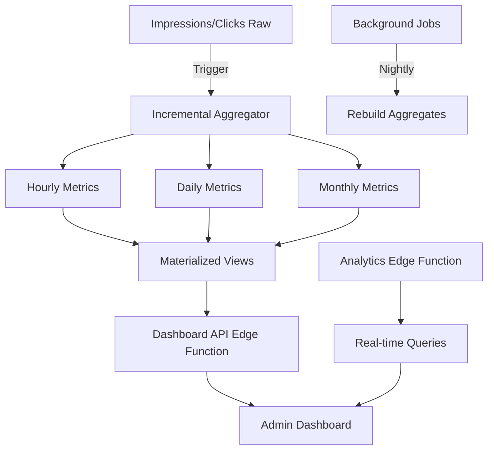

# Arquitetura de Analytics - ADS Connect

## 🎯 **Objetivo**

Criar sistema de analytics escalável para dashboards em tempo real com métricas por site, anúncio e cliente.

---

## 📊 **Visão Geral da Arquitetura**



---

## 🏗️ **Camadas da Arquitetura**

### **1. Camada de Ingestão (Já Implementada)**
- ✅ Edge Functions: `track-impression`, `track-click`
- ✅ Tabelas raw: `impressions`, `clicks`
- ✅ ~10K writes/min suportados

### **2. Camada de Agregação (Nova)**
- 📊 Agregadores incrementais (triggers)
- 📊 Tabelas de métricas horárias/diárias/mensais
- 📊 Materialized views para queries rápidas

### **3. Camada de API (Nova)**
- 🔌 Edge Function: `analytics-api`
- 🔌 Endpoints RESTful para dashboards
- 🔌 Cache em memória (Redis futuro)

### **4. Camada de Apresentação (Nova)**
- 📈 Componentes React de dashboards
- 📈 Gráficos em tempo real (Recharts/Chart.js)
- 📈 Filtros e drill-downs

---

## 📐 **Schema de Agregação**

### **Tabela: `metrics_hourly`**

```sql
CREATE TABLE metrics_hourly (
    id UUID PRIMARY KEY DEFAULT gen_random_uuid(),
    
    -- Dimensões
    hour TIMESTAMPTZ NOT NULL,
    site_id UUID REFERENCES partner_sites(id),
    ad_id UUID REFERENCES ads(id),
    client_id UUID REFERENCES clients(id),
    
    -- Métricas de Impressões
    impressions BIGINT DEFAULT 0,
    impressions_viewable BIGINT DEFAULT 0,
    impressions_blocked BIGINT DEFAULT 0,
    avg_viewability_time INTEGER, -- ms
    
    -- Métricas de Cliques
    clicks BIGINT DEFAULT 0,
    clicks_blocked BIGINT DEFAULT 0,
    conversions BIGINT DEFAULT 0,
    
    -- Métricas Calculadas
    ctr DECIMAL(5,2) DEFAULT 0, -- Click-Through Rate
    cvr DECIMAL(5,2) DEFAULT 0, -- Conversion Rate
    
    -- Revenue
    revenue_impressions DECIMAL(12,2) DEFAULT 0,
    revenue_clicks DECIMAL(12,2) DEFAULT 0,
    revenue_conversions DECIMAL(12,2) DEFAULT 0,
    revenue_total DECIMAL(12,2) DEFAULT 0,
    
    -- Anti-Fraude
    avg_fraud_score DECIMAL(5,2) DEFAULT 0,
    fraud_rate DECIMAL(5,2) DEFAULT 0,
    
    -- Metadata
    created_at TIMESTAMPTZ DEFAULT NOW(),
    updated_at TIMESTAMPTZ DEFAULT NOW(),
    
    -- Constraints
    UNIQUE(hour, site_id, ad_id, client_id)
);

-- Indexes para performance
CREATE INDEX idx_metrics_hourly_hour ON metrics_hourly(hour DESC);
CREATE INDEX idx_metrics_hourly_site ON metrics_hourly(site_id, hour DESC);
CREATE INDEX idx_metrics_hourly_ad ON metrics_hourly(ad_id, hour DESC);
CREATE INDEX idx_metrics_hourly_client ON metrics_hourly(client_id, hour DESC);

-- Index composto para queries comuns
CREATE INDEX idx_metrics_hourly_composite ON metrics_hourly(site_id, ad_id, hour DESC);
```

### **Tabela: `metrics_daily`**

```sql
CREATE TABLE metrics_daily (
    id UUID PRIMARY KEY DEFAULT gen_random_uuid(),
    
    -- Dimensões
    date DATE NOT NULL,
    site_id UUID REFERENCES partner_sites(id),
    ad_id UUID REFERENCES ads(id),
    client_id UUID REFERENCES clients(id),
    
    -- Métricas (mesma estrutura de metrics_hourly)
    impressions BIGINT DEFAULT 0,
    impressions_viewable BIGINT DEFAULT 0,
    clicks BIGINT DEFAULT 0,
    conversions BIGINT DEFAULT 0,
    ctr DECIMAL(5,2) DEFAULT 0,
    cvr DECIMAL(5,2) DEFAULT 0,
    revenue_total DECIMAL(12,2) DEFAULT 0,
    avg_fraud_score DECIMAL(5,2) DEFAULT 0,
    
    -- Metadata
    created_at TIMESTAMPTZ DEFAULT NOW(),
    updated_at TIMESTAMPTZ DEFAULT NOW(),
    
    UNIQUE(date, site_id, ad_id, client_id)
);

-- Indexes
CREATE INDEX idx_metrics_daily_date ON metrics_daily(date DESC);
CREATE INDEX idx_metrics_daily_site ON metrics_daily(site_id, date DESC);
CREATE INDEX idx_metrics_daily_ad ON metrics_daily(ad_id, date DESC);
CREATE INDEX idx_metrics_daily_client ON metrics_daily(client_id, date DESC);
```

### **Tabela: `metrics_monthly`**

```sql
CREATE TABLE metrics_monthly (
    id UUID PRIMARY KEY DEFAULT gen_random_uuid(),
    
    -- Dimensões
    month DATE NOT NULL, -- Primeiro dia do mês
    site_id UUID REFERENCES partner_sites(id),
    ad_id UUID REFERENCES ads(id),
    client_id UUID REFERENCES clients(id),
    
    -- Métricas
    impressions BIGINT DEFAULT 0,
    clicks BIGINT DEFAULT 0,
    conversions BIGINT DEFAULT 0,
    revenue_total DECIMAL(12,2) DEFAULT 0,
    
    -- Metadata
    created_at TIMESTAMPTZ DEFAULT NOW(),
    
    UNIQUE(month, site_id, ad_id, client_id)
);
```

---

## ⚡ **Agregadores Incrementais**

### **Trigger: Agregar Impressão**

```sql
CREATE OR REPLACE FUNCTION aggregate_impression()
RETURNS TRIGGER AS $$
DECLARE
    metric_hour TIMESTAMPTZ;
    metric_date DATE;
BEGIN
    -- Calcular hora e data
    metric_hour := DATE_TRUNC('hour', NEW.timestamp);
    metric_date := DATE_TRUNC('day', NEW.timestamp)::DATE;
    
    -- Agregar por hora
    INSERT INTO metrics_hourly (
        hour, site_id, ad_id, client_id,
        impressions, impressions_viewable, impressions_blocked,
        revenue_impressions, avg_fraud_score
    )
    SELECT
        metric_hour,
        NEW.site_id,
        NEW.ad_id,
        (SELECT client_id FROM partner_sites WHERE id = NEW.site_id),
        1,
        CASE WHEN NEW.is_viewable THEN 1 ELSE 0 END,
        CASE WHEN NEW.is_blocked THEN 1 ELSE 0 END,
        NEW.revenue,
        NEW.fraud_score
    ON CONFLICT (hour, site_id, ad_id, client_id)
    DO UPDATE SET
        impressions = metrics_hourly.impressions + 1,
        impressions_viewable = metrics_hourly.impressions_viewable + 
            CASE WHEN NEW.is_viewable THEN 1 ELSE 0 END,
        impressions_blocked = metrics_hourly.impressions_blocked + 
            CASE WHEN NEW.is_blocked THEN 1 ELSE 0 END,
        revenue_impressions = metrics_hourly.revenue_impressions + NEW.revenue,
        avg_fraud_score = (metrics_hourly.avg_fraud_score * metrics_hourly.impressions + NEW.fraud_score) / 
            (metrics_hourly.impressions + 1),
        updated_at = NOW();
    
    -- Agregar por dia
    INSERT INTO metrics_daily (
        date, site_id, ad_id, client_id,
        impressions, impressions_viewable, revenue_total
    )
    SELECT
        metric_date,
        NEW.site_id,
        NEW.ad_id,
        (SELECT client_id FROM partner_sites WHERE id = NEW.site_id),
        1,
        CASE WHEN NEW.is_viewable THEN 1 ELSE 0 END,
        NEW.revenue
    ON CONFLICT (date, site_id, ad_id, client_id)
    DO UPDATE SET
        impressions = metrics_daily.impressions + 1,
        impressions_viewable = metrics_daily.impressions_viewable + 
            CASE WHEN NEW.is_viewable THEN 1 ELSE 0 END,
        revenue_total = metrics_daily.revenue_total + NEW.revenue,
        updated_at = NOW();
    
    RETURN NEW;
END;
$$ LANGUAGE plpgsql;

CREATE TRIGGER trigger_aggregate_impression
    AFTER INSERT ON impressions
    FOR EACH ROW
    EXECUTE FUNCTION aggregate_impression();
```

### **Trigger: Agregar Clique**

```sql
CREATE OR REPLACE FUNCTION aggregate_click()
RETURNS TRIGGER AS $$
DECLARE
    metric_hour TIMESTAMPTZ;
    metric_date DATE;
BEGIN
    metric_hour := DATE_TRUNC('hour', NEW.timestamp);
    metric_date := DATE_TRUNC('day', NEW.timestamp)::DATE;
    
    -- Agregar por hora
    INSERT INTO metrics_hourly (
        hour, site_id, ad_id, client_id,
        clicks, clicks_blocked, conversions,
        revenue_clicks, revenue_conversions
    )
    SELECT
        metric_hour,
        NEW.site_id,
        NEW.ad_id,
        (SELECT client_id FROM partner_sites WHERE id = NEW.site_id),
        1,
        CASE WHEN NEW.is_blocked THEN 1 ELSE 0 END,
        CASE WHEN NEW.converted THEN 1 ELSE 0 END,
        NEW.revenue,
        COALESCE(NEW.conversion_value, 0)
    ON CONFLICT (hour, site_id, ad_id, client_id)
    DO UPDATE SET
        clicks = metrics_hourly.clicks + 1,
        clicks_blocked = metrics_hourly.clicks_blocked + 
            CASE WHEN NEW.is_blocked THEN 1 ELSE 0 END,
        conversions = metrics_hourly.conversions + 
            CASE WHEN NEW.converted THEN 1 ELSE 0 END,
        revenue_clicks = metrics_hourly.revenue_clicks + NEW.revenue,
        revenue_conversions = metrics_hourly.revenue_conversions + 
            COALESCE(NEW.conversion_value, 0),
        ctr = CASE 
            WHEN metrics_hourly.impressions > 0 
            THEN ((metrics_hourly.clicks + 1)::DECIMAL / metrics_hourly.impressions) * 100
            ELSE 0
        END,
        updated_at = NOW();
    
    -- Agregar por dia (similar)
    -- ...
    
    RETURN NEW;
END;
$$ LANGUAGE plpgsql;

CREATE TRIGGER trigger_aggregate_click
    AFTER INSERT ON clicks
    FOR EACH ROW
    EXECUTE FUNCTION aggregate_click();
```

---

## 📈 **Materialized Views**

### **View: Dashboard Overview**

```sql
CREATE MATERIALIZED VIEW dashboard_overview AS
SELECT
    -- Métricas Globais (últimas 24h)
    SUM(impressions) as total_impressions,
    SUM(clicks) as total_clicks,
    ROUND(AVG(ctr), 2) as avg_ctr,
    SUM(revenue_total) as total_revenue,
    
    -- Top Sites
    (SELECT json_agg(row_to_json(t))
     FROM (
         SELECT site_id, SUM(impressions) as impressions
         FROM metrics_hourly
         WHERE hour > NOW() - INTERVAL '24 hours'
         GROUP BY site_id
         ORDER BY impressions DESC
         LIMIT 5
     ) t) as top_sites,
    
    -- Top Ads
    (SELECT json_agg(row_to_json(t))
     FROM (
         SELECT ad_id, SUM(clicks) as clicks
         FROM metrics_hourly
         WHERE hour > NOW() - INTERVAL '24 hours'
         GROUP BY ad_id
         ORDER BY clicks DESC
         LIMIT 5
     ) t) as top_ads
    
FROM metrics_hourly
WHERE hour > NOW() - INTERVAL '24 hours';

-- Refresh automático a cada 5 minutos
CREATE UNIQUE INDEX ON dashboard_overview ((true));
```

### **View: Métricas por Site**

```sql
CREATE MATERIALIZED VIEW site_metrics_summary AS
SELECT
    ps.id as site_id,
    ps.name as site_name,
    ps.domain,
    
    -- Últimas 24h
    COALESCE(SUM(mh.impressions) FILTER (WHERE mh.hour > NOW() - INTERVAL '24 hours'), 0) as impressions_24h,
    COALESCE(SUM(mh.clicks) FILTER (WHERE mh.hour > NOW() - INTERVAL '24 hours'), 0) as clicks_24h,
    COALESCE(SUM(mh.revenue_total) FILTER (WHERE mh.hour > NOW() - INTERVAL '24 hours'), 0) as revenue_24h,
    
    -- Últimos 7 dias
    COALESCE(SUM(md.impressions) FILTER (WHERE md.date > CURRENT_DATE - 7), 0) as impressions_7d,
    COALESCE(SUM(md.clicks) FILTER (WHERE md.date > CURRENT_DATE - 7), 0) as clicks_7d,
    COALESCE(SUM(md.revenue_total) FILTER (WHERE md.date > CURRENT_DATE - 7), 0) as revenue_7d,
    
    -- Últimos 30 dias
    COALESCE(SUM(md.impressions) FILTER (WHERE md.date > CURRENT_DATE - 30), 0) as impressions_30d,
    COALESCE(SUM(md.clicks) FILTER (WHERE md.date > CURRENT_DATE - 30), 0) as clicks_30d,
    COALESCE(SUM(md.revenue_total) FILTER (WHERE md.date > CURRENT_DATE - 30), 0) as revenue_30d

FROM partner_sites ps
LEFT JOIN metrics_hourly mh ON mh.site_id = ps.id
LEFT JOIN metrics_daily md ON md.site_id = ps.id
GROUP BY ps.id, ps.name, ps.domain;

CREATE UNIQUE INDEX ON site_metrics_summary (site_id);
```

---

## 🔌 **Edge Function: Analytics API**

```typescript
// supabase/functions/analytics-api/index.ts

import { serve } from 'https://deno.land/std@0.168.0/http/server.ts';
import { createClient } from 'https://esm.sh/@supabase/supabase-js@2';

const supabase = createClient(
  Deno.env.get('SUPABASE_URL')!,
  Deno.env.get('SUPABASE_SERVICE_ROLE_KEY')!
);

serve(async (req) => {
  const { pathname } = new URL(req.url);
  
  // CORS
  if (req.method === 'OPTIONS') {
    return new Response(null, { status: 204, headers: corsHeaders });
  }
  
  try {
    // Rotas
    if (pathname === '/dashboard/overview') {
      return await getDashboardOverview();
    }
    
    if (pathname === '/metrics/site') {
      const { searchParams } = new URL(req.url);
      const siteId = searchParams.get('site_id');
      return await getSiteMetrics(siteId);
    }
    
    if (pathname === '/metrics/ad') {
      const { searchParams } = new URL(req.url);
      const adId = searchParams.get('ad_id');
      return await getAdMetrics(adId);
    }
    
    if (pathname === '/metrics/client') {
      const { searchParams } = new URL(req.url);
      const clientId = searchParams.get('client_id');
      return await getClientMetrics(clientId);
    }
    
    return new Response('Not Found', { status: 404 });
    
  } catch (error) {
    return new Response(JSON.stringify({ error: error.message }), {
      status: 500,
      headers: { 'Content-Type': 'application/json' },
    });
  }
});

async function getDashboardOverview() {
  const { data, error } = await supabase
    .from('dashboard_overview')
    .select('*')
    .single();
  
  if (error) throw error;
  
  return new Response(JSON.stringify(data), {
    headers: { 'Content-Type': 'application/json' },
  });
}

async function getSiteMetrics(siteId: string) {
  const { data, error } = await supabase
    .from('site_metrics_summary')
    .select('*')
    .eq('site_id', siteId)
    .single();
  
  if (error) throw error;
  
  return new Response(JSON.stringify(data), {
    headers: { 'Content-Type': 'application/json' },
  });
}

// ... outras funções
```

---

## 📊 **Componentes de Dashboard**

### **Dashboard Overview Component**

```typescript
// components/analytics/DashboardOverview.tsx

import { useEffect, useState } from 'react';
import { LineChart, Line, BarChart, Bar, XAxis, YAxis, Tooltip } from 'recharts';

export function DashboardOverview() {
  const [metrics, setMetrics] = useState(null);
  
  useEffect(() => {
    loadMetrics();
    const interval = setInterval(loadMetrics, 30000); // Refresh a cada 30s
    return () => clearInterval(interval);
  }, []);
  
  async function loadMetrics() {
    const response = await fetch('/functions/v1/analytics-api/dashboard/overview');
    const data = await response.json();
    setMetrics(data);
  }
  
  if (!metrics) return <Loading />;
  
  return (
    <div className="grid grid-cols-4 gap-6">
      {/* KPI Cards */}
      <MetricCard
        title="Impressões (24h)"
        value={metrics.total_impressions.toLocaleString()}
        trend="+12%"
      />
      <MetricCard
        title="Cliques (24h)"
        value={metrics.total_clicks.toLocaleString()}
        trend="+8%"
      />
      <MetricCard
        title="CTR Médio"
        value={`${metrics.avg_ctr}%`}
        trend="+0.5%"
      />
      <MetricCard
        title="Revenue (24h)"
        value={`R$ ${metrics.total_revenue.toLocaleString()}`}
        trend="+15%"
      />
      
      {/* Charts */}
      <div className="col-span-2">
        <h3>Impressões por Hora</h3>
        <LineChart width={600} height={300} data={metrics.hourly_data}>
          <Line type="monotone" dataKey="impressions" stroke="#10b981" />
          <XAxis dataKey="hour" />
          <YAxis />
          <Tooltip />
        </LineChart>
      </div>
      
      <div className="col-span-2">
        <h3>Top Sites</h3>
        <BarChart width={600} height={300} data={metrics.top_sites}>
          <Bar dataKey="impressions" fill="#10b981" />
          <XAxis dataKey="site_name" />
          <YAxis />
          <Tooltip />
        </BarChart>
      </div>
    </div>
  );
}
```

---

## 🚀 **Estratégia de Escalabilidade**

### **Fase 1: Atual (0-100K impressões/dia)**
- ✅ PostgreSQL nativo
- ✅ Materialized views
- ✅ Refresh manual/agendado

### **Fase 2: Crescimento (100K-1M impressões/dia)**
- 📊 TimescaleDB extension (hypertables)
- 📊 Particionamento por tempo
- 📊 Continuous aggregates
- 📊 Compression policies

```sql
-- Habilitar TimescaleDB
CREATE EXTENSION IF NOT EXISTS timescaledb;

-- Converter para hypertable
SELECT create_hypertable('impressions', 'timestamp');
SELECT create_hypertable('clicks', 'timestamp');

-- Continuous aggregates
CREATE MATERIALIZED VIEW metrics_hourly_continuous
WITH (timescaledb.continuous) AS
SELECT
    time_bucket('1 hour', timestamp) AS hour,
    site_id,
    ad_id,
    COUNT(*) as impressions,
    SUM(revenue) as revenue
FROM impressions
GROUP BY hour, site_id, ad_id;

-- Refresh policy (automático)
SELECT add_continuous_aggregate_policy('metrics_hourly_continuous',
    start_offset => INTERVAL '3 hours',
    end_offset => INTERVAL '1 hour',
    schedule_interval => INTERVAL '1 hour');

-- Compression (dados > 7 dias)
ALTER TABLE impressions SET (
    timescaledb.compress,
    timescaledb.compress_segmentby = 'site_id, ad_id'
);

SELECT add_compression_policy('impressions', INTERVAL '7 days');
```

### **Fase 3: Escala (1M+ impressões/dia)**
- 🔥 ClickHouse para analytics OLAP
- 🔥 Redis para cache de dashboards
- 🔥 CDC (Change Data Capture) para sync
- 🔥 Kafka para streaming

---

## 📋 **Checklist de Implementação**

### **Fase 1: Fundação (Semana 1-2)**
- [ ] Criar tabelas de métricas (hourly, daily, monthly)
- [ ] Implementar triggers de agregação
- [ ] Criar materialized views
- [ ] Testar performance de agregação

### **Fase 2: API (Semana 3)**
- [ ] Criar Edge Function `analytics-api`
- [ ] Implementar endpoints de métricas
- [ ] Adicionar cache em memória
- [ ] Documentar API

### **Fase 3: Dashboard (Semana 4-5)**
- [ ] Criar componentes React de dashboards
- [ ] Implementar gráficos (Recharts)
- [ ] Adicionar filtros e drill-downs
- [ ] Testes de usabilidade

### **Fase 4: Otimização (Semana 6)**
- [ ] Adicionar TimescaleDB
- [ ] Configurar continuous aggregates
- [ ] Implementar compression policies
- [ ] Benchmark de performance

---

## 🎯 **Métricas de Sucesso**

| Métrica | Target | Atual |
|---------|--------|-------|
| **Dashboard Load Time** | <2s | TBD |
| **API Response Time (p95)** | <500ms | TBD |
| **Aggregation Lag** | <5min | TBD |
| **Storage Growth** | <10GB/mês | TBD |
| **Query Performance** | <100ms | TBD |

---

**Status:** 📐 **ARQUITETURA DEFINIDA** - Pronto para implementação!
